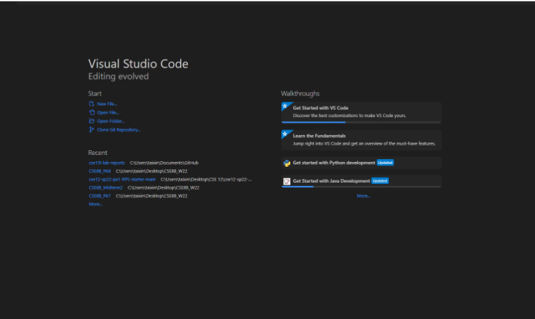
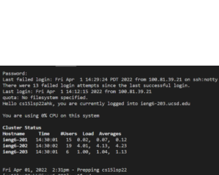
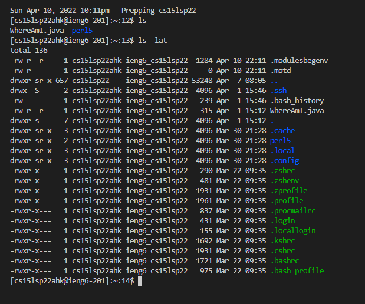
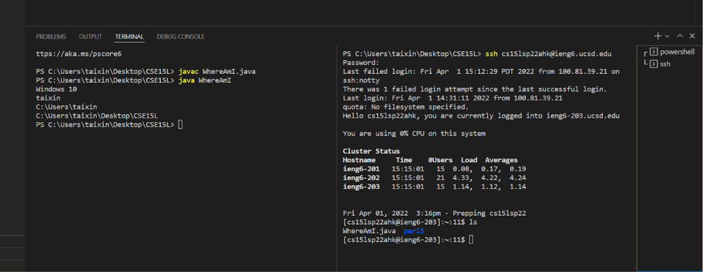

# Week 2 Lab Report

## Installing VScode

Download the VScode from https://code.visualstudio.com/

Run the installer and follow the install procedures

## Remotely Connecting

## Try Some Commands

## Move Files with scp

## Setting an SSH Key

## Optimizing Remote Running

