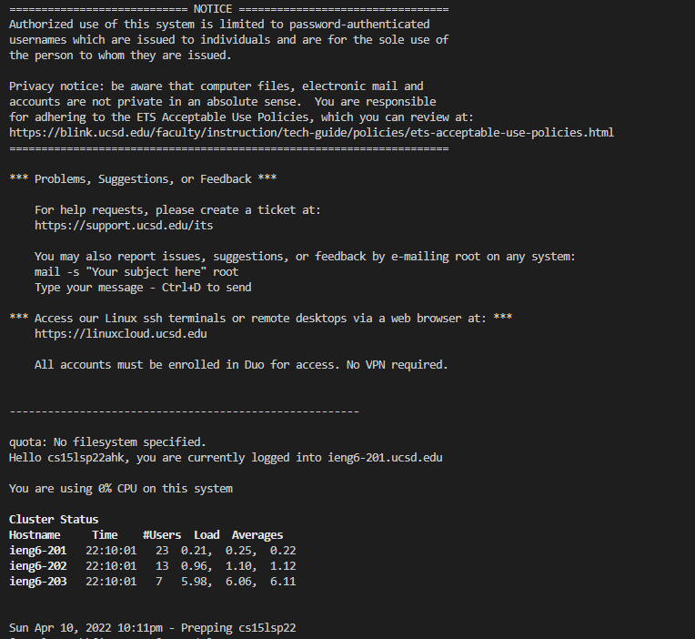
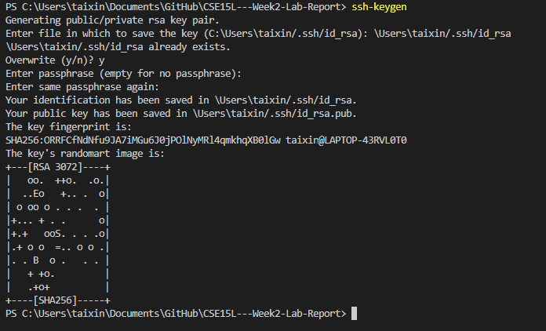
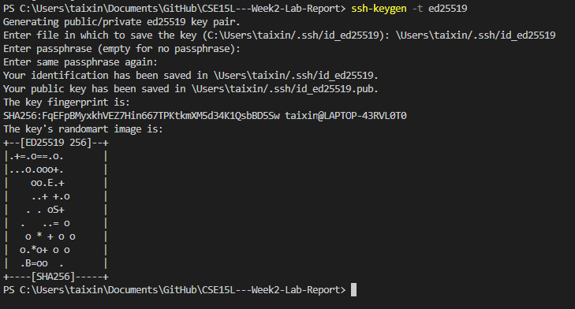
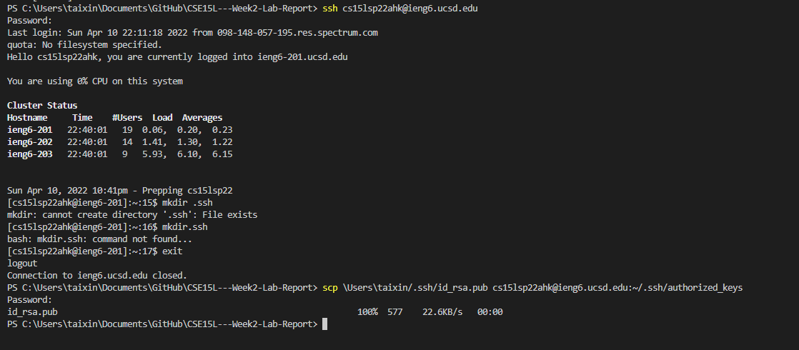

# Week 2 Lab Report

## Installing VScode

Download the VScode from https://code.visualstudio.com/

Run the installer and follow the install procedures

## Remotely Connecting

## Try Some Commands

## Move Files with scp

## Setting an SSH Key

Step 1: ssh-keygen

Step 2: ssh-keygen -t ed25519

Step 3: copy key to .ssh directory

Note: I already have the file, so i can't create directory '.ssh'

## Optimizing Remote Running

